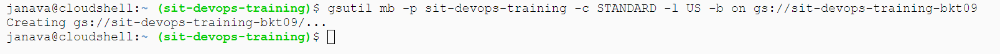
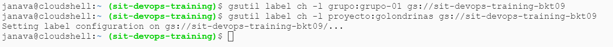
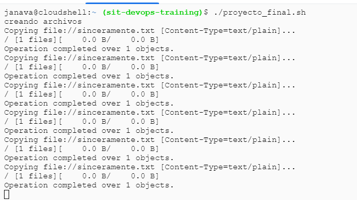
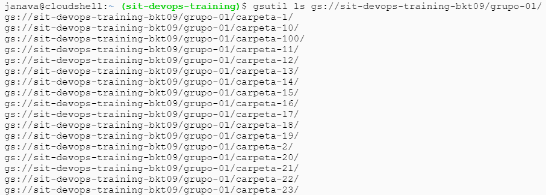

# 
 PROYECTO FINAL GRUPO 01 

## 
 GOLONDRINAS 
    

### INTEGRANTES GRUPO 01

| INTEGRANTE                      | ACTIVIDADES REALIZADAS                                             |
|---------------------------------|--------------------------------------------------------------------|
|     1                           | ACT                                                                |
|     2                           | ACT                                                                |
|     3                           | ACT                                                                |
|     4                           | ACT                                                                |
|     5                           | ACT                                                                |

# Lineas de comandos

+ Creación de Bucket solicitado
~~~
CREACION="gsutil mb -p sit-devops-training -c STANDARD -l US -b on gs://sit-devops-training-bktX09
~~~

+ Asignación de Etiquetas al Bucket creado
~~~
ETIQUETA1="gsutil label ch -l grupo:grupo-01 gs://sit-devops-training-bkt09"  
ETIQUETA2="gsutil label ch -l proyecto:golondrinas gs://sit-devops-training-bkt09"  

~~~

+ Creación del archivo vacio
~~~
touch sinceramente.txt
~~~

+ Creación de las carpetas y copia de los archivos vacios en cada una de las carpetas creadas.

~~~

#!/bin/bash

for i in {1..100}
do
        gsutil cp sinceramente.txt gs://sit-devops-training-bkt03/carpeta-$i/
done

~~~

+ Función que indique en qué carpetas están los archivos no vacíos de nombre sinceramente.txt

~~~

#!/bin/bash
vacio(){
sleep 0.001 
}
archivo(){
        echo "En carpeta-$i hay un archivo"

}
for i in {1..100}
do
variable=$(gsutil du gs://sit-devops-training-bkt09/grupo-01/carpeta-$i/sinceramente.txt)
#echo "La variable tiene $variable"
if [ "$variable" = "0            gs://sit-devops-training-bkt09/grupo-01/carpeta-$i/sinceramente.txt" ];
then

        vacio

else
        archivo

fi
done
generalog(){

        echo "Se genero un log en grupo-01-$(date +"%Y-%m-%d-%I-%M").log"
        $date  >> grupo-01-$(date +"%Y-%m-%d-%I-%M").log
        echo "Grupo 01" >> grupo-01-$(date +"%Y-%m-%d-%I-%M").log
        uname -a >> grupo-01-$(date +"%Y-%m-%d-%I-%M").log
        echo "El usuario $USER ejecuto el bash" >> grupo-01-$(date +"%Y-%m-%d-%I-%M").log
}
generalog
~~~
